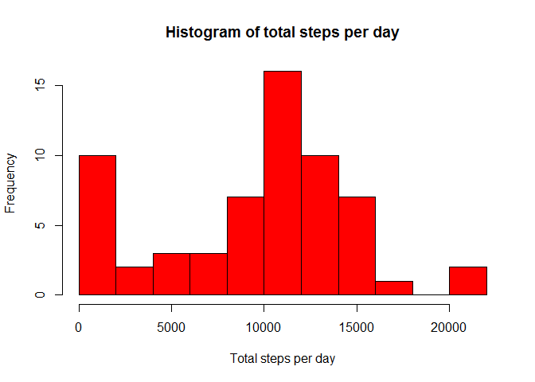
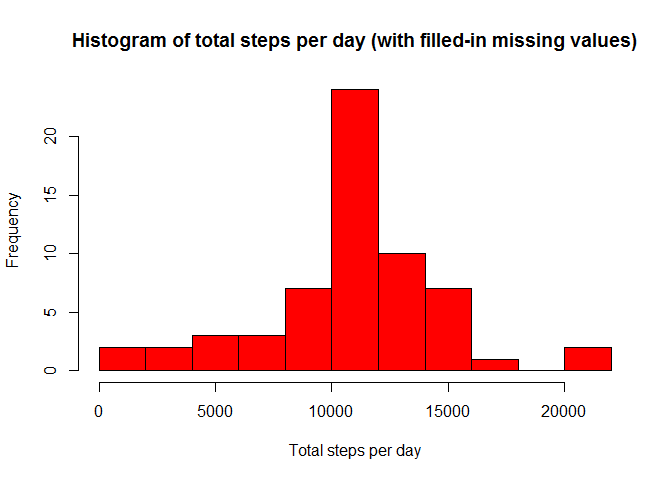

# Reproducible Research: Peer Assessment 1


## Loading and preprocessing the data
1. Load the data (i.e. read.csv())

```r
if(!file.exists('activity.csv')){
    unzip('activity.zip')
}
activity <- read.csv('activity.csv')
head(activity)
```

```
##   steps       date interval
## 1    NA 2012-10-01        0
## 2    NA 2012-10-01        5
## 3    NA 2012-10-01       10
## 4    NA 2012-10-01       15
## 5    NA 2012-10-01       20
## 6    NA 2012-10-01       25
```

2. Process/transform the data (if necessary) into a format suitable for your analysis

```r
activity$date <- as.Date(activity$date, "%Y-%m-%d")
```


## What is mean total number of steps taken per day?

1. Calculate the total number of steps taken per day

```r
stepsPerDay <- aggregate(steps ~ date, data = activity, sum, na.rm = TRUE)
```

2. Make a histogram of the total number of steps taken each day

```r
hist(stepsPerDay$steps, main = "Histogram of total steps per day", 
     xlab = "Total steps per day", col = "red", nclass = 10)
```

 

3. Calculate and report the mean and median of the total number of steps taken per day

```r
options(scipen = 1, digits = 2)
stepsPerDayMean <- mean(stepsPerDay$steps)
stepsPerDayMedian <- median(stepsPerDay$steps)
```
* Mean: 10766.19
* Median: 10765


## What is the average daily activity pattern?

1. Make a time series plot (i.e. type = "l") of the 5-minute interval (x-axis) and the average number of steps taken, averaged across all days (y-axis)

```r
timeSeries <- tapply(activity$steps, activity$interval, mean, na.rm = TRUE)
plot(row.names(timeSeries), timeSeries, type = "l", xlab = "5-min interval", 
     ylab = "Average across all days", main = "Average number of steps taken per 5 minutes", 
     col = "red")
```

 

2. Which 5-minute interval, on average across all the days in the dataset, contains the maximum number of steps?

```r
maxInterval <- which.max(timeSeries)
IntervalResult <- names(maxInterval)
```
The 835 interval contains the maximum number of steps on average across all the days.


## Imputing missing values

1. Calculate and report the total number of missing values in the dataset (i.e. the total number of rows with NAs)

```r
totalNAs <- sum(is.na(activity))
```
The total number of missing values in the dataset is 2304

2. Devise a strategy for filling in all of the missing values in the dataset. The strategy does not need to be sophisticated. (the mean for that 5-minute interval is used).

```r
stepsMean <- aggregate(steps ~ interval, data = activity, FUN = mean)
fillNum <- numeric()
for (i in 1:nrow(activity)) {
    irow <- activity[i, ]
    if (is.na(irow$steps)) {
        steps <- subset(stepsMean, interval == irow$interval)$steps
    } else {
        steps <- irow$steps
    }
    fillNum <- c(fillNum, steps)
}
```


3. Create a new dataset that is equal to the original dataset but with the missing data filled in.

```r
activity_filled <- activity
activity_filled$steps <- fillNum
```

4. (a) Make a histogram of the total number of steps taken each day and Calculate and report the mean and median total number of steps taken per day. 

```r
timeSeries_filled <- tapply(activity_filled$steps, activity_filled$interval, mean, na.rm = TRUE)
plot(row.names(timeSeries_filled), timeSeries_filled, type = "l", xlab = "5-min interval", 
     ylab = "Average across all days", 
     main = "Average number of steps taken per 5 minutes (with filling all NAs)", 
     col = "red")
```

 

4. (b) Do these values differ from the estimates from the first part of the assignment? What is the impact of imputing missing data on the estimates of the total daily number of steps?

```r
stepsPerDay_filled <- aggregate(steps ~ date, data = activity_filled, sum, na.rm = TRUE)
stepsPerDayMean_filled <- mean(stepsPerDay_filled$steps)
stepsPerDayMedian_filled <- median(stepsPerDay_filled$steps)
```
- New Mean: 10766.19
- New Median: 10766.19

After replacing the missing values, the new mean is the same as the ealier one, but the new median is slightly larger than the old one and becomes the same as the value of mean.


## Are there differences in activity patterns between weekdays and weekends?

1. Create a new factor variable in the dataset with two levels - "weekday" and "weekend" indicating whether a given date is a weekday or weekend day. (The dataset with filled-in missing values is used in this part)

```r
day <- weekdays(activity_filled$date)
daylevels <- vector()
for (i in 1:nrow(activity_filled)) {
    if (day[i] == "Saturday" | day[i] == "Sunday") {
        daylevels[i] <- "weekend"
    } else {
        daylevels[i] <- "weekday"
    }
}
activity_filled$daylevel <- daylevels
activity_filled$daylevel <- factor(activity_filled$daylevel)
```


2. Make a panel plot containing a time series plot (i.e. type = "l") of the 5-minute interval (x-axis) and the average number of steps taken, averaged across all weekday days or weekend days (y-axis). See the README file in the GitHub repository to see an example of what this plot should look like using simulated data.

```r
timeSeries_daylevels <- aggregate(steps ~ interval + daylevels, data = activity, mean)
names(timeSeries_daylevels) <- c("interval", "daylevels", "steps")
library(lattice)
```

```
## Warning: package 'lattice' was built under R version 3.1.3
```

```r
xyplot(steps ~ interval | daylevels, timeSeries_daylevels, type = "l", layout = c(1, 2), 
       xlab = "Interval", ylab = "Number of steps")
```

 

